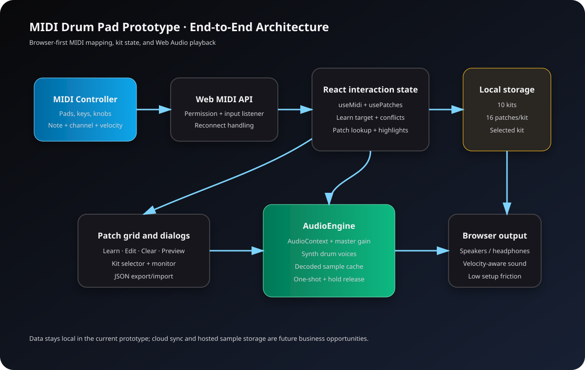

# MIDI Drum Pad Prototype

## End-to-End Product, Technical, and Business Handbook

**Document status:** Current project snapshot  
**Audience:** Product owners, music-technology teams, operators, designers, and engineers  
**Product type:** Browser-based MIDI performance and patch-mapping tool  
**Primary platform:** Chromium browsers with Web MIDI support  

---

## 1. Executive Summary

MIDI Drum Pad Prototype turns a browser into a lightweight drum-pad control surface. A user connects a MIDI controller, assigns incoming notes to one of 16 visible patches, chooses a synthesized drum sound or custom audio sample, and performs with low-friction preview and monitoring tools.

The product is positioned between a hardware utility and a creative performance workspace:

- **For performers:** fast setup, visible mappings, dependable pad learning, and immediate sound preview.
- **For producers:** multiple genre-oriented kits, custom one-shot samples, velocity-sensitive playback, and hold/one-shot modes.
- **For educators and demonstrators:** an approachable way to explain MIDI notes, channels, velocity, and audio routing in the browser.
- **For product teams:** a focused foundation that can evolve into a hosted preset library, collaborative performance tool, or paid creative utility.


*Product mood reference: electronic percussion hardware. Photo by Pixabay via Pexels.*

---

## 2. Product Vision

### Vision

Make MIDI performance setup feel immediate, visual, and dependable without requiring desktop music software for every small performance or demonstration.

### Core promise

**Connect a controller, learn a note, choose a sound, and play.**

### Current product boundary

This is a browser-based prototype, not a full digital audio workstation. It intentionally focuses on:

- MIDI input discovery and connection
- Note-to-patch mapping
- 16-patch organization
- Synthesized drum sounds
- In-memory custom audio samples
- Local browser persistence
- Live MIDI monitoring

It does not currently provide accounts, cloud synchronization, recording, multi-user collaboration, exportable audio, or a server-side sample library.

---

## 3. Business Opportunity

### Target customers and users

| Segment | Problem | Product value |
|---|---|---|
| Live performers | Hardware mappings are slow to inspect or change | Visible, learnable mappings and fast kit switching |
| Bedroom producers | Desktop tools can be heavy for quick ideas | Instant browser setup with synth and sample playback |
| Music educators | MIDI concepts are abstract for beginners | Live monitor, note labels, channels, velocity, and visual feedback |
| Content creators | Need simple interactive music demonstrations | Shareable browser experience with no installation |
| Hardware manufacturers | Need companion configuration utilities | A reusable browser control layer for MIDI devices |

### Differentiation

1. **Learning-first workflow:** a user can press Learn and then press a physical controller pad instead of manually entering note numbers.
2. **Visual confidence:** the monitor shows incoming device, channel, note, velocity, and mapping resolution.
3. **Hybrid sound engine:** built-in synthesized sounds work immediately, while custom samples support personalization.
4. **Kit-based organization:** the same 16-pad layout can switch between Standard, Electronic, Acoustic, Hip-Hop, Rock, Latin, Percussion, Techno, Jazz, and Trap presets.
5. **No-installation entry point:** supported users can begin in a browser.

### Potential commercial models

These are business options, not currently implemented features:

- **Freemium:** free local MIDI mapping; paid cloud kits, sample storage, and sync.
- **Creator subscription:** unlimited custom kits, version history, share links, and collaborative libraries.
- **Device companion licensing:** branded versions for MIDI controller manufacturers.
- **Education licensing:** classroom dashboards, guided lessons, and student workspaces.
- **One-time Pro purchase:** advanced routing, recording, and downloadable session bundles.

### Success metrics

Recommended product metrics for a future hosted version:

- Time from first visit to first successful sound
- MIDI connection success rate
- Percentage of users who complete their first Learn action
- Number of patches mapped per active session
- Kit switches per session
- Preview-to-save conversion rate
- Seven-day return rate
- Custom sample assignment rate
- Audio failure rate by browser and device type

### Business risks and mitigations

| Risk | Impact | Mitigation |
|---|---|---|
| Web MIDI browser support varies | Users may not connect | Detect support, explain supported browsers, offer a simulator mode later |
| Browser audio permissions interrupt sound | First-use confusion | Keep an explicit Test Audio action and resume the audio context on interaction |
| Samples are not persisted as binary data | Mappings may reference unavailable samples after reload | Add private cloud storage or a downloadable project bundle in a future release |
| Different controllers use different channels | Learning may appear inconsistent | Keep channel visible and provide an optional channel-agnostic mode later |
| Local-only data is device-specific | Users cannot move setups between devices automatically | Expand JSON export/import into project bundles and cloud sync |

---

## 4. User Experience and Main Flows

### 4.1 First-time setup

1. Open the application in a Web MIDI-capable browser.
2. Grant MIDI access when the browser asks.
3. Connect a MIDI controller.
4. Select the detected input from the MIDI Device panel.
5. Press **Connect**.
6. Press **Test Audio** to unlock or confirm browser audio.
7. Choose a kit from the toolbar.

### 4.2 Learn a patch

1. Select **Learn** on a patch card.
2. The patch enters an amber learning state.
3. Press a pad or key on the MIDI controller.
4. The incoming channel and note are captured.
5. If the note is already assigned, the conflict dialog offers:
   - Replace the existing assignment
   - Allow a duplicate
   - Cancel the operation
6. The patch displays the note number, channel, musical note name, and drum name when available.

### 4.3 Perform

1. Play the mapped controller pad.
2. The matching patch is highlighted briefly.
3. The audio engine chooses the patch's synth sound or loaded sample.
4. MIDI velocity controls loudness.
5. One-shot sounds finish automatically; Hold sounds stop on MIDI Note OFF.
6. The monitor records the incoming event for inspection.

### 4.4 Edit a patch

The Edit action opens a focused patch editor. A user can change:

- Patch name
- Synth sound
- Volume
- Default velocity
- Playback mode
- MIDI note and channel
- Enabled status
- Custom audio/video sample
- Synth-versus-sample playback choice

### 4.5 Clear a patch

The Clear action removes the MIDI note and channel assignment while leaving the patch's name, sound, volume, playback mode, and sample choice intact. This makes it possible to remap a patch without rebuilding its sound design.

### 4.6 Save, export, and import

- **Save:** writes the current kit and mappings to browser storage.
- **Export:** downloads a JSON mapping file.
- **Import JSON:** replaces the active patch mapping with normalized imported data.
- **Import audio/video:** decodes a sample into the session's in-memory sample library.

Important current limitation: imported audio is decoded for the active browser session. The patch mapping can remember a sample reference, but the binary audio file itself is not stored in browser storage.

---

## 5. Visual Product Tour

### Main interface areas

1. **Header:** product identity and current 16-patch status.
2. **Toolbar:** kit selector, audio status, Test Audio, Save, Reset, Export, and one universal Import control.
3. **MIDI Device panel:** permission status, device selector, Connect, Refresh, and device metadata.
4. **Test panel:** last MIDI message and waiting state.
5. **MIDI Monitor:** recent events with device, channel, note, velocity, and mapped patch.
6. **Patch Grid:** 16 patch cards with Learn, Edit, Clear, and Preview controls.
7. **Dialogs:** duplicate-note conflict resolution and detailed patch editing.

### Motion reference

The following public-domain animation illustrates the idea of an audio waveform moving through a system. It is a conceptual reference, not an application screenshot.

[](https://commons.wikimedia.org/wiki/File:Sound_wave_physics.gif)

*Animation reference: “Sound wave physics.gif” by Kulayada, Wikimedia Commons, CC BY-SA 4.0. Verify the license before redistributing outside this document.*

---

## 6. System Architecture



### End-to-end event path

```text
MIDI controller
    |
    v
Browser Web MIDI API
    |
    v
useMidi: permission, device list, input listener, event parsing
    |
    +--> MIDI Monitor state
    |
    +--> usePatches: learn target or note-to-patch lookup
    |          |
    |          +--> Patch highlight
    |          +--> Learn capture / conflict dialog
    |
    +--> App audio callback
               |
               v
        AudioEngine.ensure()
               |
               +--> Synth drum voice
               +--> Decoded custom AudioBuffer
               |
               v
        Master GainNode -> browser audio output
```

### Architectural layers

| Layer | Responsibility |
|---|---|
| Presentation | React views for toolbar, device panel, monitor, patch cards, and dialogs |
| Interaction state | `usePatches` for kits, mappings, learning, conflicts, and patch updates |
| Device integration | `useMidi` for Web MIDI access, device selection, reconnection, and event callbacks |
| MIDI domain | Parsing status bytes, channels, note-on/note-off classification, names, and drum labels |
| Audio domain | Web Audio context, synthesized instruments, decoded sample cache, voices, release behavior |
| Persistence | Browser `localStorage` for kits, selected kit, and normalized mapping data |
| Build/deployment | Vite production build with static hosting output |

---

## 7. Technical Implementation Details

### Frontend stack

- React 18
- TypeScript
- Vite
- Tailwind CSS
- Lucide React icons
- Web MIDI API
- Web Audio API
- Browser `localStorage`

### Patch data model

Each patch contains:

| Field | Meaning |
|---|---|
| `id` | Stable visible patch number from 1 to 16 |
| `name` | User-facing patch label |
| `note` | MIDI note number, or empty when unassigned |
| `channel` | MIDI channel from 1 to 16 |
| `velocity` | Last received velocity or default velocity |
| `sound` | One of the built-in drum sound identifiers |
| `volume` | Patch volume from 0 to 1 |
| `enabled` | Whether MIDI triggering is active |
| `playbackMode` | `oneshot` or `hold` |
| `sampleKey` | Session reference to a decoded sample |
| `sampleName` | Display name of the loaded sample |

### Kit data model

A kit contains an ID, a display name, and exactly 16 patch records. Ten default kit presets are generated from sound assignments. The selected kit ID is stored independently so the application can reopen on the last active kit.

### Persistence behavior

- Kit data key: `midi-drum-pad-prototype:kits:v1`
- Selected kit key: `midi-drum-pad-prototype:selected-kit:v1`
- Legacy standalone patch key: `midi-drum-pad-prototype:patches:v2`
- Old 32-entry arrays are normalized to 16 entries.
- Missing optional sample fields are filled with `null` during normalization.
- The application uses local storage rather than Supabase in the current implementation because the product currently has no accounts or shared data flow.

### MIDI behavior

- MIDI channels are represented as 1–16.
- Note-on with velocity 0 is treated as Note OFF.
- Note-on with velocity greater than 0 triggers a patch or records a Learn action.
- Note OFF releases Hold-mode voices.
- Device listeners are reattached when a selected input reconnects.
- Callback refs keep live mapping and learning state available to incoming MIDI events.

### Audio behavior

The engine creates one browser audio context and a master gain node. Synth voices include kick, snare, hats, clap, toms, cymbals, percussion, tones, shakers, guiro, and whistle. Custom files are decoded with `decodeAudioData` and cached as `AudioBuffer` objects in memory.

Velocity is converted to a normalized gain value and multiplied by patch volume. Each active voice has a stable key so repeated hits can stop or replace the previous voice cleanly.

### Error and empty states

The interface exposes visible states for:

- Unsupported Web MIDI browser
- MIDI permission denied
- MIDI access error
- No MIDI device detected
- Audio decode failure
- Invalid JSON mapping
- Unsupported import type
- Duplicate MIDI note conflict
- No note assigned to a patch

---

## 8. Deployment and Operations

### Build output

The project is a static Vite application. The production build produces an `index.html`, bundled JavaScript, bundled CSS, and redirect configuration under the deployment output directory.

### Recommended deployment checklist

- Serve over HTTPS because Web MIDI permission and device access are browser-protected.
- Validate the deployed build in Chrome or Edge with a physical MIDI controller.
- Test first audio interaction through **Test Audio**.
- Confirm device permission, device selection, and reconnection behavior.
- Test both Note ON and Note OFF messages.
- Test all ten kit presets.
- Test JSON export/import.
- Test at least one WAV and one MP3 sample.
- Confirm mobile layout even though Web MIDI support is primarily desktop-oriented.

### Observability for a hosted product

A future hosted version should record privacy-safe operational metrics rather than raw performance data by default. Useful events include connection success, browser capability, audio decode success, kit selection, mapping completion, and import failure category.

Do not upload MIDI performance streams or user samples without explicit consent and a clear retention policy.

---

## 9. Quality Assurance Plan

### Functional test matrix

| Area | Test |
|---|---|
| MIDI permission | Allow, deny, reload, and reconnect |
| Device discovery | Connect before opening, after opening, and after Refresh |
| Learning | Learn an empty patch, remap a patch, cancel Learn |
| Conflicts | Replace, duplicate, and cancel duplicate-note dialog |
| Clearing | Clear mapped patch, verify sound settings remain, remap afterward |
| Sound preview | Preview every built-in sound and every patch card |
| Kits | Switch across all ten kits and confirm independent mappings |
| Samples | Load valid audio, reject invalid file, toggle synth/sample, remove sample |
| Persistence | Reload after Save and confirm the active kit and mapping remain |
| Import/export | Export 16 patches, import legacy 32-entry file, import invalid JSON |
| Responsive layout | Desktop, tablet, and narrow mobile widths |

### Release gates

- TypeScript typecheck passes.
- Production build passes.
- No console errors during the golden path.
- MIDI connection tested on at least one supported browser.
- Preview, Clear, Learn, Save, Export, Import, and kit switching manually verified.
- No user data is deleted by an upgrade or normalization step.

---

## 10. Roadmap

### Near term

- Add a clear “sample loaded” library view so imported samples can be assigned intentionally.
- Persist sample binaries through a project bundle download or private object storage.
- Add keyboard-accessible labels and focus states to all patch actions.
- Add a browser-based MIDI simulator for users without hardware.
- Add automated tests for MIDI parsing, patch normalization, conflict resolution, and storage migration.

### Medium term

- Add user accounts and private cloud kit synchronization.
- Add per-kit export/import rather than only active mappings.
- Add input channel filters and channel-agnostic learning.
- Add velocity curves, choke groups, pitch, pan, and per-patch effects.
- Add a lightweight performance recorder with downloadable MIDI or audio output.

### Long term

- Collaborative kit sharing with permissions.
- Device-specific templates and branded companion experiences.
- Version history and rollback for professional setups.
- Paid sample packs and creator marketplaces.
- Desktop packaging for deeper MIDI and audio device access.

---

## 11. Glossary

- **MIDI:** a protocol describing musical events such as note, channel, and velocity rather than carrying recorded audio.
- **Note ON:** a MIDI event that starts a sound.
- **Note OFF:** a MIDI event that releases a held sound.
- **Velocity:** the force value of a MIDI note, represented from 0 to 127.
- **Patch:** one visible playable assignment in the 16-patch grid.
- **Kit:** a named collection of 16 patches.
- **Synth voice:** a sound generated by the browser's Web Audio API.
- **Sample:** decoded audio loaded from a user-selected file.
- **One-shot:** a sound that finishes by itself after triggering.
- **Hold:** a sound that remains active until Note OFF or release handling stops it.
- **Web MIDI API:** the browser capability used to communicate with MIDI inputs.
- **Web Audio API:** the browser capability used to generate, route, and play audio.

---

## 12. Ownership and Change Guidance

When changing this project:

1. Preserve the MIDI event path and test it before changing presentation behavior.
2. Keep patch normalization backward-compatible with existing local data.
3. Treat custom sample references as session-sensitive unless binary persistence is added.
4. Keep user-facing errors visible and actionable.
5. Test all 16 cards rather than only the first few, because sound and mapping behavior is patch-specific.
6. Keep the product's main promise intact: connect, learn, map, and play with minimal setup.

---

## Media attribution

- Hero/reference photo: Pixabay, hosted by Pexels. Image URL supplied through Pexels search for this handbook.
- Wave animation: Kulayada, “Sound wave physics.gif,” Wikimedia Commons, CC BY-SA 4.0. Source page: https://commons.wikimedia.org/wiki/File:Sound_wave_physics.gif
